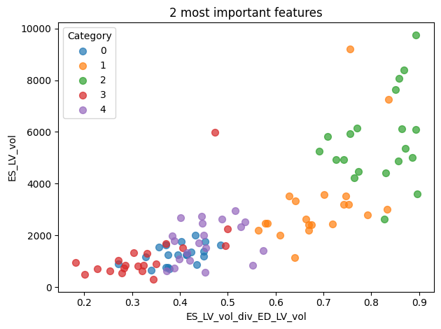

### 1. Trouver des features cohérents et les caluler.
    - volume des deux ventricules et mycordium.
        
### 2. Segmentation ventricule gauche pour le test.

Empiriquement on voit que le ventricule gauche est situé au milieu de la myocardium. On va donc prendre avantage que dans le test la mycordium est déjà segmenter.  

-> on va déja vérifier la donné. 

Ok 

###  Les features. 

1) volume de tout + Masse + taille. + dif temporel. 

Ce que ne peut pas faire un random forest c'est rapport donc il faut que dans features il y ait des rapport. On va faire ça
J'ai mis au début la difference entre les deux timings mais en fait un random forest peut trouver ça aussi (a-b > 4 ) random forest peut faire a> 6 b<2 donc pas besoin je les enlèves 
{'classifier__max_depth': 10, 'classifier__max_features': 'sqrt', 'classifier__min_samples_leaf': 1, 'classifier__min_samples_split': 2, 'classifier__n_estimators': 100}
0.85 0.07071067811865474
1.0 0.0

I added the ratios. Now I have got around 30 features.

to do : 

    rapport de l'intersection sur l'union entre les deux temporalité

### 3. Le point majeur de ce challenge. Il n'y a pas beacoup de données. 

I will try data augmentation to see the results.

I know what i am doing wrong... In my cross val as i have data and a bit of noisy data that is almost the same the score don't really mean something as it is like trainning on it..

    it needs to be added in the pipeline. The cross val will select a the trainning and apply data augmentation.

Mixture model. 

By analysing the result of the predicted proba of my model. I found that the only case where the model had a hard time was between class 2 and 3. SO I thought of creating a separate model that could handle just this. When predicted proba are two low for this class use a differente model that is specialized in separtaing this two class only. SO I will train another model to do taht. Problem is that data is even further reduced. only 40 samples then.

ne pas overfitter.

problème des colonnes correler ou bien des colonnes tel que a tres proche de 1/a. Je me dis que lorsque qu'on boostrap on a moins de chance de "perdre" ces colonnes et ducoup c'est pas bien.

On vise ici le 1 d'accuracy. donc on est un peut obliger d'avoir plus de 0.99 d'accuracy sur un cv sur le train. Mais il ne faut pas overfitter.

Au début j'avais force min samples split à 2 pour éviter un gros overfitting. Mais j'ai l'impression qu'avec un RF et mes features il y a des outliers qui nécessite un min samples split de 1.

Souvent les probabilités qui sont proche de 0.5 arrive entre les classes 2 et 3 donc je me suis dit que j'allais entrainer un autre modele (pas du même type sinon il allait faire la même chose, les mêmes séparations) uniquement pour s'entrainer à séparer ces deux classes.

Bayesian search

In order to really compare different results / model I really need to take into account how much the model is sure of himself. Entropy seems a good measure. The more the model have multiple high probabilities the more it is uncertain.

